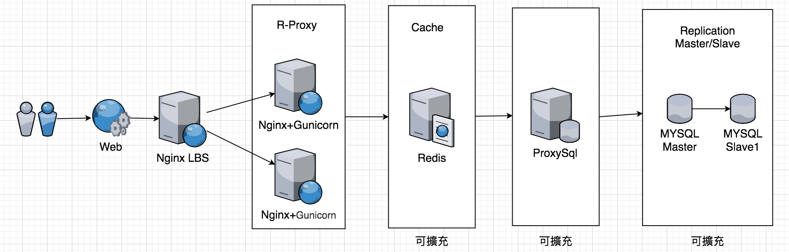

# B2E_TASK
Implement an URL shortener service

### 環境
* OS:CentOS 7
* Code : Python Flask
* Web Server : Gunicorn 
* R-PROXY & LBS Server : Nginx
* Cache Server : Redis
* DB Server : Mysql
  
### 分析需求

1. 產生短網址 - API Service  
	1.1. 認證API :  透過帳號密碼認證後，取得Token訪問接下來的API  
	1.2. 短網址API : 實際產生短網址的 API  
	1.3 區分版本號為 api/v1  
	
[認證API Request]	

```http --auth demo@gmail.com:1qaz2wsx  --json POST http://python.thinkted.com.tw/api/v1/tokens```
[認證Response]	
```
HTTP/1.1 200 OK
Connection: keep-alive
Content-Length: 163
Content-Type: application/json
Date: Mon, 16 Mar 2020 23:22:26 GMT
Server: nginx/1.16.1

{
    "expiration": 3600,
    "token": "eyJhbGciOiJIUzI1NiIsImlhdCI6MTU4NDQwMDk0NiwiZXhwIjoxNTg0NDA0NTQ2fQ.eyJpZCI6MX0.pdliciYNcG-LxkviulOh3mNkhlf3jnLturj8WqbQ2hU"
}
```
[ShortUrl API Request]	
```
http --json --auth eyJhbGciOiJIUzI1NiIsImlhdCI6MTU4NDQwMDk0NiwiZXhwIjoxNTg0NDA0NTQ2fQ.eyJpZCI6MX0.pdliciYNcG-LxkviulOh3mNkhlf3jnLturj8WqbQ2hU: --json POST  http://python.thinkted.com.tw/api/v1/shorturl/ "url=http://www.google.com"
```
[ShortUrl Response]	
```
HTTP/1.1 200 OK
Connection: keep-alive
Content-Length: 33
Content-Type: application/json
Date: Mon, 16 Mar 2020 23:46:00 GMT
Server: nginx/1.16.1

"http://p.thinkted.com/ed646a33"
```	
 
2. 使用短網址 - Web Service  
		2.1 須注意高並發機制  
		2.2 Server Warm Up 機制 

### 系統初擬架構 

針對 高並發機制如下
1. Nginx R-Proxy 為第一層Cache 機制，配以Nginx LBS，分散Request量  
2. 避免大量直接訪問DB，中間做第二層Redis Cache   
  	2.1 視需求量體，可以做Redis 的 Cluster 但需要注意 RedisLock 的問題。  
3. Mysql Connection 在做高並發時會是瓶頸，使用Master/Slave機制分流。  
	3.1 ProxySql 可調節讀寫分流，避免程式端直接誤用Master/Slave 分流  
	3.2 視需求量體，可以將Master Write使用Queue寫入，可以再次緩衝Mysql的Connection數  
	3.3 視需求量體 若考慮到HA機制，可改為DRBD 或 Galera Cluster 
4. 需設定好Warm Up 機制，若主機須重開機情況下，大量Request在第一次會直接訪問到DB  
	4.1 在Nginx開機前，須將Data以Queue的方式餵入Redis  

 
